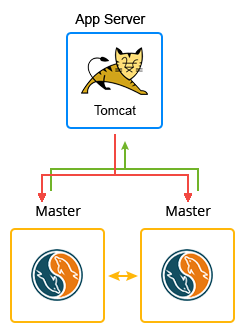

## Liferay Portal

The JPS package deploys [Liferay](http://www.liferay.com/) that initially contains 1 application server and database cluster. 

### Highlights
It is designed to deploy Liferay environment as an enterprise web platform for building business solutions that deliver immediate results and long-term value.
Liferay has built its business becoming the best partner for providing enterprise-quality support, updates and management tools to companies running Liferay in production.
To store data it has MySQL database cluster with Master-Master replicatioon topology. Such replication topology provides additional benefits, such as quick response to the requests and High Availability capabilities with DNS round-robin load-balancing. 

### Environment Topology

**Liferay Version**: Community Edition 7.1 CE GA1 
**Tomcat Version**: 9 
**Java Engine**: Java 8 
**MySQL Database**: 5.7.22

### Deployment

In order to get this solution instantly deployed, click the "Get It Hosted Now" button, specify your email address within the widget, choose one of the [Jelastic Public Cloud providers](https://jelastic.cloud) and press Install.

To deploy this package to Jelastic Private Cloud, import [this JPS manifest](../../raw/master/manifest.jps) within your dashboard ([detailed instruction](https://docs.jelastic.com/environment-export-import#import)).

**Notes**: 
  * Once Liferay is installed the first launch takes time up to 5 minutes, so be patient.
  * Replace user ***root*** database credentials with credentials for user ***liferay*** provided in respective email.
  * Replace example email address with your real one and use it for the first login along with password "***test***" during initialization phase.
  * Change password with more secure one.

More information about Jelastic JPS package and about installation widget for your website can be found in the [Jelastic JPS Application Package](https://github.com/jelastic-jps/jpswiki/wiki/Jelastic-JPS-Application-Package) reference.
